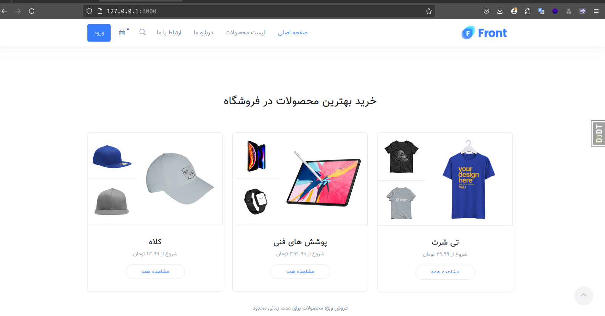
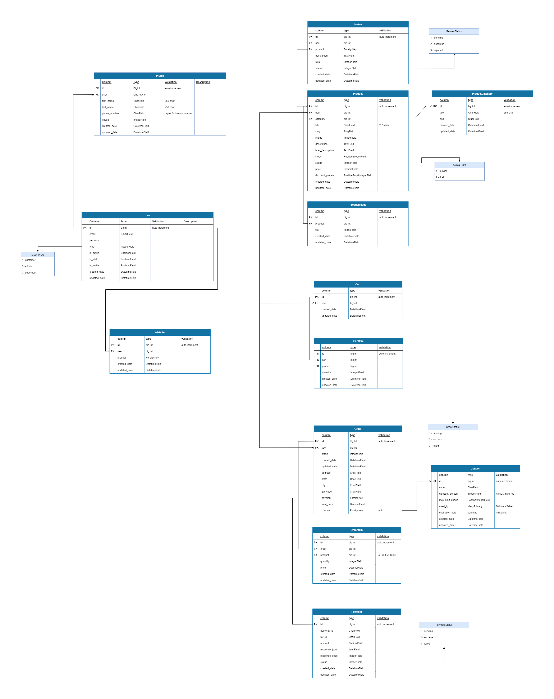

# django-shop
a example of a Django application which indicates a shop written in python

# Goal

This is a sample project to show you how to create a ecommerce website, and how to interact with users and payment gateway and also how to manage orders and products.

# Demo

the video will show you a demo of the project and what are the capabilities and what features are included.

# Database Schema

the provided schema is the main database design of the project based on the models we have used in django project.

